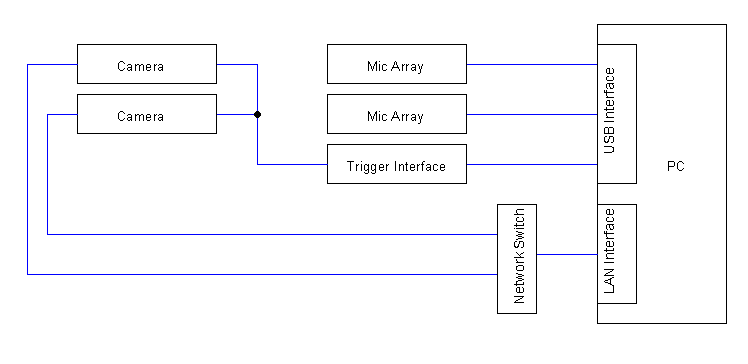

# Extension of USV Cam for 16 Channel and Multiarray and -camera use

**[USVCAM](https://github.com/MatsumotoJ/usvcam)** by [MatsumotoJ](https://github.com/MatsumotoJ) is an acoustic camera system for localization and assignment of ultrasonic vocalizations (USVs) for
interacting laboratory rodents. Thanks to its design utilizing a small, phased microphone array combined with a camera,
USVCAM has many advantages over the previous systems using a distributed microphone array.
It originally is written for a 4 mic array. This software extends the support to 16 and implements other hardware to
scale it to n cameras and microphone arrays. It lays the foundation for the use of the system with primates and expending it to three dimensions.

## Hardware

This system utilizes two microphone arrays and cameras but should be scalable to as much as needed (with limitations of hardware capability and python performance of course).
The microphone arrays used are the MiniDSP UMA-16 v2 USB mic array with the miniDSP_UAC2_v4.82.0_2020-06-09 Windows Drivers.
These are directly connected via USB Interface. Secondly, we have the Trigger Interface from 
National Instruments NI USB-6211 with a modified Digital Output and the NI-DAQmx Device Driver version 23.3.0f166.
This is connected to the PC via USB and with the Triggering to Hirose Spitter to the Cameras.
The cameras in turn are connected via LAN to the PC for the Recording.

## Software
Entry point of the software is the main.py file. This software records audio and keeps track of the timing of trigger activation in relation to audio recording for later synchronization. It only records audio, so video has to be recorded separately and can be done on a second system, if computation resources are problematic.
The video file can then be moved to the in the main configured temp file with the according video file name to be combined and syncronized with the audio. It can then be processed further with the modified USVCAM software also accessed in the main. The USVSeg software is used for the segmentation. A camera calibration file has to be made for the specific setup in advance.

## Getting Started
The extension will be added to the **[USVCAM](https://github.com/MatsumotoJ/usvcam)** by [MatsumotoJ](https://github.com/MatsumotoJ) soon and should ideally be used with the according documentation there.
If you want to use the version here:
Run and read main.py. Look at data/mic_calibration_recording
(additional software like drivers might be needed)

## Acknowledgements
Thanks to [MatsumotoJ](https://github.com/MatsumotoJ) for the great Research Internship at your Institute and all the ways you helped me during this time. I also want to thank a member of the Kyoto Primate Institute (who I don't know if he wants to get mentioned here), for referring me to [MatsumotoJ](https://github.com/MatsumotoJ). I hope my contribution will help in your future research.
